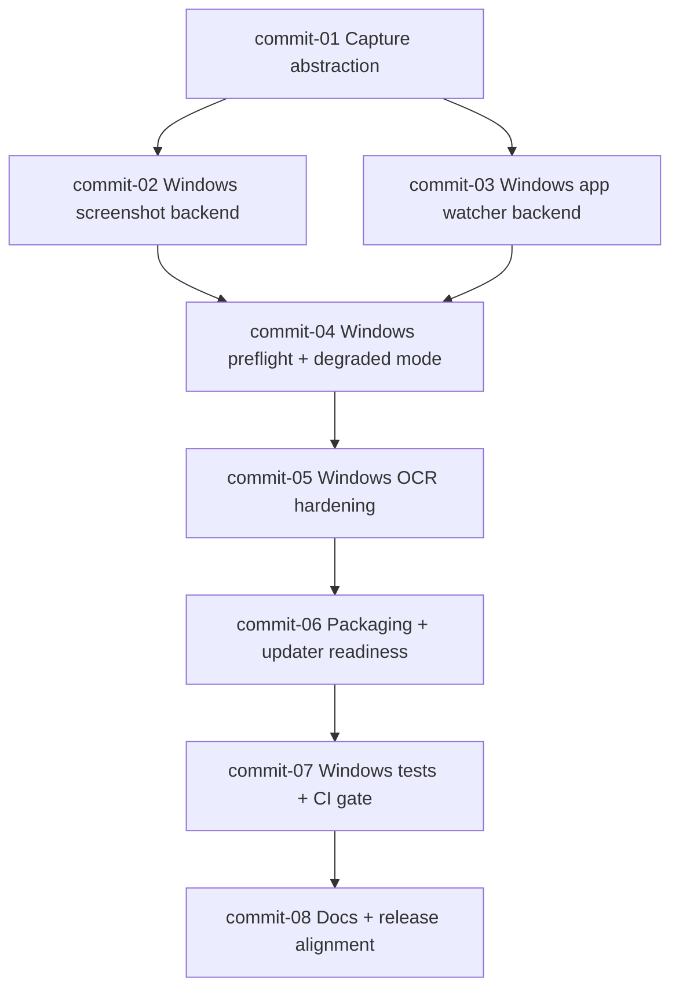

# Windows Re-Enable Commit Plan

Difficulty scale: `S` (small), `M` (medium), `L` (large)

## Commit Breakdown

1. **commit-01: Capture backend abstraction**
   - Add platform backend interface + selector for v2 screenshot capture.
   - Difficulty: `M`

2. **commit-02: Windows screenshot backend**
   - Implement `win32` screenshot backend that returns the same capture contract as macOS.
   - Difficulty: `L`

3. **commit-03: Windows app/window watcher**
   - Add `win32` app-watcher backend and wire it through `app-watcher.ts`.
   - Difficulty: `L`

4. **commit-04: Windows preflight + degraded mode**
   - Extend startup checks for Windows dependencies and surface clear degraded-mode warnings.
   - Difficulty: `M`

5. **commit-05: Windows OCR hardening**
   - Improve OCR readiness checks, timeouts, and actionable error diagnostics.
   - Difficulty: `M`

6. **commit-06: Packaging + updater readiness**
   - Finalize Windows packaging inputs, signing assumptions, and updater validation.
   - Difficulty: `M`

7. **commit-07: Windows test coverage + CI gate**
   - Add unit/integration tests for Windows paths and a Windows CI job.
   - Difficulty: `M`

8. **commit-08: Docs + release status alignment**
   - Update README/release notes/install guidance to match actual Windows state.
   - Difficulty: `S`

## Dependency Graph

## Suggested Order

`commit-01 -> commit-02 -> commit-03 -> commit-04 -> commit-05 -> commit-06 -> commit-07 -> commit-08`
